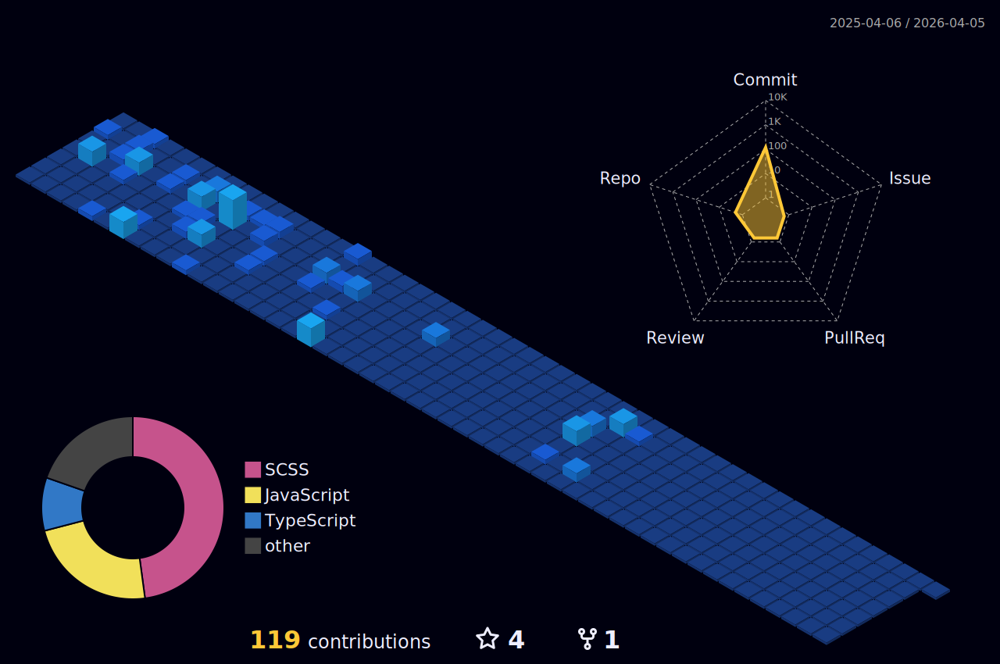

<h1 align="center">
  
</h1>

 Estudiante de Ingeniería en Informática en Duoc UC, apasionado por el desarrollo web y en constante aprendizaje.  
  Actualmente estoy trabajando en un proyecto académico con <strong>Laravel</strong> y explorando nuevas tecnologías. 😉
  

  
### 🚀 Tecnologías con las que trabajo

- **Frontend:** HTML, CSS, JavaScript, TypeScript
- **Backend:** PHP (Laravel), Node.js (básico)
- **Base de datos:** MySQL, SQL
- **Herramientas:** Git, GitHub, VS Code

---

### 📌 Proyectos destacados

🔹 [Portafolio Profesional - PORTAFOLIO-2.0](https://github.com/jjmmcode/PORTAFOLIO-2.0)  
🔹 [APP_MOVIL](https://github.com/jjmmcode/PRUEBA_PROG_MOVIL)  
🔹 [E-Commerce Discos Vinilos](https://github.com/jjmmcode/EXAMEN-PROG-WEB)  
🔹 [Proyecto Académico con Laravel](#) *(privado por ahora)*

---

### 🌱 Actualmente aprendiendo
- Laravel 10
- REST APIs
- SQL avanzado

---
  

 
  
## En lo que más me enfoco ahora:

  

    
  

## Mi Actividad:

<!--
**jjmmcode/jjmmcode** is a ✨ _special_ ✨ repository because its `README.md` (this file) appears on your GitHub profile.

Here are some ideas to get you started:

- 🔭 I’m currently working on ...
- 🌱 I’m currently learning ...
- 👯 I’m looking to collaborate on ...
- 🤔 I’m looking for help with ...
- 💬 Ask me about ...
- 📫 How to reach me: ...
- 😄 Pronouns: ...
- ⚡ Fun fact: ...
-->
